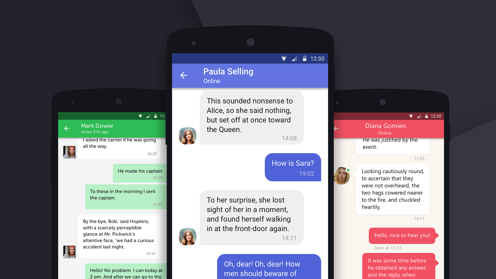

[  ](https://bintray.com/troy379/maven/ChatKit/_latestVersion)

# ChatKit for Android

ChatKit is a library designed to simplify the development of UI for such a trivial task as chat. It has flexible possibilities for styling, customizing and data management

<p align="center">

</p>

### Features

* Ready-to-use already styled solution for quick implementation;
* Fully customizable layouts - setting styles out of the box (use your own colors, text appearances, drawables, selectors and sizes) or even create your own custom markup or/and holders for unique behaviour;
* List of dialogs, including tete-a-tete and group chats, markers for unread messages and last user message view;
* List of messages (incoming and outcoming) with history pagination and already calculated dates headers;
* Different avatars with no specific realization of image loading - you can use any library you want;
* Selection mode for interacting with messages;
* Easy dates formatting;
* Your own models for dialogs and messages - there is no converting needed;
* Ready to use message input view;
* Custom animations (according to RecyclerView usage).

### How to use

To implement all of the features above you can use the following components:

* [DialogsList](docs/COMPONENT_DIALOGS_LIST.MD);
* [MessagesList](docs/COMPONENT_MESSAGES_LIST.md);
* [MessageInput](docs/COMPONENT_MESSAGE_INPUT.MD);


### Download

Download via Gradle:
```gradle
compile 'com.github.stfalcon:chatkit:0.1.1'
```

or Maven:
```xml
<dependency>
  <groupId>com.github.stfalcon</groupId>
  <artifactId>chatkit</artifactId>
  <version>0.1.1</version>
  <type>pom</type>
</dependency>
```

### Try it

Check out the [sample project](/sample/src/main) to try it yourself! :wink:

### Change log
[See the changelog](docs/CHANGELOG.md) to be aware of latest improvements and fixes.

### Gratitude

We were inspired by [JSQMessagesViewController](https://github.com/jessesquires/JSQMessagesViewController) library for iOS. In our plans to improve functionality to give Android developers wide opportunities to create fast and good-looking UI for chats in their applications.

Please, contact us via github@stfalcon.com if you are using this library, just to let us know :)
Thank you!

### License

```
Copyright (C) 2017 stfalcon.com

Licensed under the Apache License, Version 2.0 (the "License");
you may not use this file except in compliance with the License.
You may obtain a copy of the License at

http://www.apache.org/licenses/LICENSE-2.0

Unless required by applicable law or agreed to in writing, software
distributed under the License is distributed on an "AS IS" BASIS,
WITHOUT WARRANTIES OR CONDITIONS OF ANY KIND, either express or implied.
See the License for the specific language governing permissions and
limitations under the License.

```