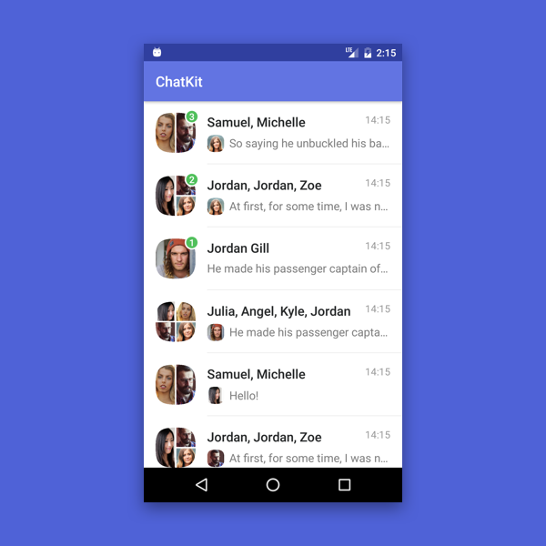
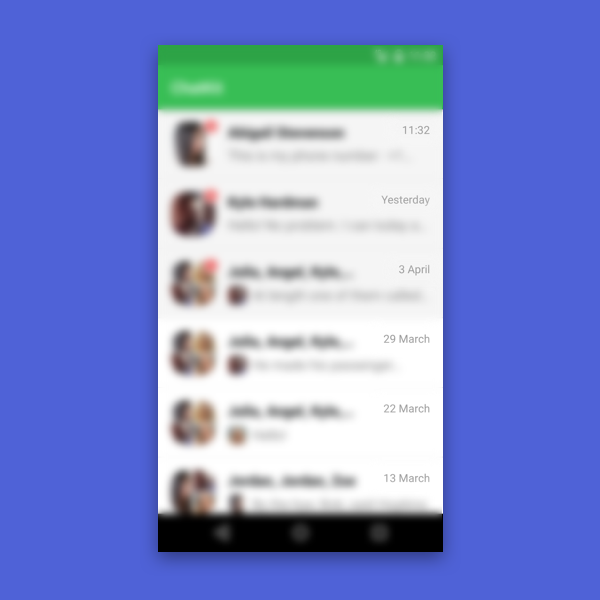
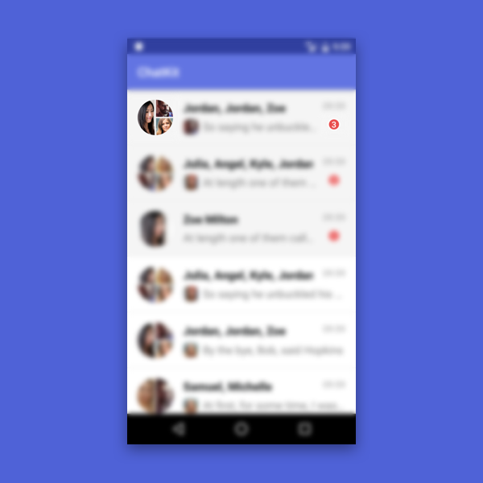
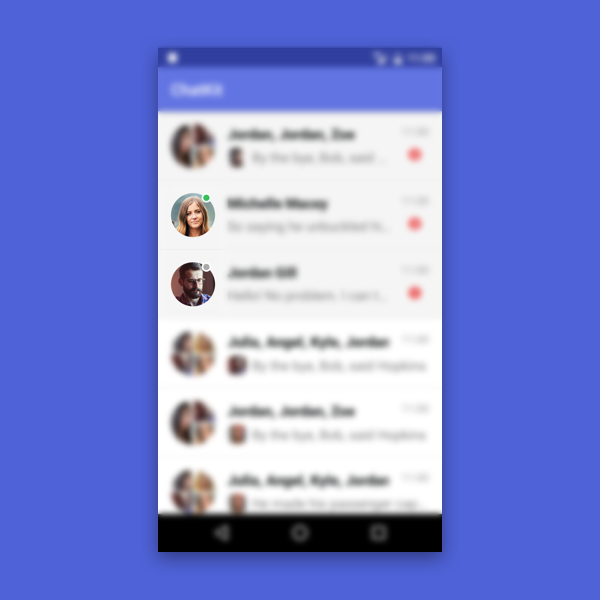

# DialogsList

DialogsList is a component for displaying and management of a dialog list. The main features: fast and simple implementation, one-on-one and group dialog support, unread messages’ markers. Also there are several customization methods for changing appearance of dialog list and realization of additional features, which are not included by default.
<p align="center">

</p>

## How to make it work

To start using the component, you just need to follow a few steps:

#### Add the widget into your xml layout:

```xml
<com.stfalcon.chatkit.dialogs.DialogsList
   android:id="@+id/dialogsList"
   android:layout_width="match_parent"
   android:layout_height="match_parent"/>
```

#### Set an adapter

For `DialogsList` default realization you just need to transfer dialog list and dialog avatar image upload realization to adapter’s constructor ([Click here to know more about image loading](IMAGE_LOADER.md)).

```java
DialogsListAdapter dialogsListAdapter = new DialogsListAdapter<>(dialogs, new ImageLoader() {
   @Override
   public void loadImage(ImageView imageView, String url) {
       //If you using another library - write here your way to load image
       Picasso.with(DialogsListActivity.this).load(url).into(imageView);
   }
});

dialogsListView.setAdapter(dialogsListAdapter);
```

#### Prepare your model

To be able to add dialog, you must implement the `IDialog` interface to your existing model and override its methods:

```java
public class DefaultDialog implements IDialog {

/*...*/

@Override
public String getId() {
   return id;
}

@Override
public String getDialogPhoto() {
   return dialogPhoto;
}

@Override
public String getDialogName() {
   return dialogName;
}

@Override
public ArrayList<IUser> getUsers() {
   return users;
}

@Override
public IMessage getLastMessage() {
   return lastMessage;
}

@Override
public void setLastMessage(IMessage lastMessage) {
   this.lastMessage = lastMessage;
}

@Override
public int getUnreadCount() {
   return unreadCount;
}
```

As you can see, you need also to implement the `IUser` interface for message author:

```java
public class Author implements IUser {

   /*...*/

   @Override
   public String getId() {
       return id;
   }

   @Override
   public String getName() {
       return name;
   }

   @Override
   public String getAvatar() {
       return avatar;
   }
}
```

That's all! This approach allows the adapter to work with your dialog model without any converting of types!

## Data management

#### Setting and adding new dialogs

When your models are ready to be used by adapter, you can simply add them to the list. There is four ways to do this:

* adapter.setItems(List<DIALOG> items) - replaces existing list with a new dialog list;
* adapter.addItems(List<DIALOG> items) - adds a new dialog list to the end of the list;
* adapter.addItem(DIALOG dialog) - adds one dialog to the end of the list
* adapter.addItem(int position, DIALOG dialog) -  adds a new dialog to the specified position.
* adapter.upsertItem(DIALOG dialog) - adds one dialog to the end of the list if not exists, otherwise updates the existing dialog.

#### Updating dialogs
If dialog has changed, you can update it by position in list by calling `adapter.updateItem(int position, DIALOG item)` or update it by dialog id by calling `adapter.updateItemById(DIALOG item)`

There’s also a method provided to update a last dialog message. To do so, you need to call `adapter.updateDialogWithMessage(String dialogId, IMessage message)`.  This method returns `true`, if a dialog with given id is in the list and it’s updated, and “false”, if a dialog is not found. It allows to provide an opportunity to create a new dialog, if it’s not in the list. For example:

```java
private void onNewMessage(String dialogId, IMessage message) {
   if (!dialogsListAdapter.updateDialogWithMessage(dialogId, message)) {
       //Dialog with this ID doesn't exist, so you can create new Dialog or reload all dialogs list
   }
}
```

#### Deleting dialog

To delete messages from the list, you need to call `adapter.deleteById(String id)`.
To delete all of the dialogs, just call `adapter.clear()` method.

## Interact with user actions

Of course, the adapter have listeners for such important actions as short and long clicks. They just returns a message object that has been pressed, with a type that is specified as the generic type of adapter:

```java
dialogsListAdapter.setOnDialogClickListener(new DialogsListAdapter.OnDialogClickListener<Dialog>() {
   @Override
   public void onDialogClick(Dialog dialog) {
       //On item click action
   }
});

dialogsListAdapter.setOnDialogLongClickListener(new DialogsListAdapter.OnDialogLongClickListener<Dialog>() {
   @Override
   public void onDialogLongClick(Dialog dialog) {
       //on long item click action
   }
});
```

## Make it look the way you want

Certainly, initially defined appearance will not be suitable for everybody. And again, we have several options to solve this problem.

#### Dates format
By default, the date in the dialogs is specified in the `HH: mm` format , but this does not satisfy all requirements. For example, you need to display such common options as "Today", "Yesterday", "Last week" etc. To achieve this we have the `DateFormatter.Formatter` interface:
```java
@Override
public String format(Date date) {
   if (DateFormatter.isToday(date)) {
       return DateFormatter.format(date, DateFormatter.Template.TIME);
   } else if (DateFormatter.isYesterday(date)) {
       return getString(R.string.date_header_yesterday);
       …...
   } else {
       return DateFormatter.format(date, DateFormatter.Template.STRING_DAY_MONTH_YEAR);
   }
}
```
After creating it, you can pass it to adapter:
```java
dialogsAdapter.setDatesFormatter(this);
```
...and get this kind of result:
<p align="center">

</p>

#### Styling via attributes

The simplest way to customize appearance is to use `DialogsList` widget attributes. With them we can set elements separately for read and unread dialogs: element’ background color, font size, color and text style for a dialog title, a last message, a date of last message. And also for dialog’s avatar size and last message author’s avatar size (only for group chats), setting a separator between elements (appearance, color, indents).

For example, when you define attributes like this:
```xml
<com.stfalcon.chatkit.dialogs.DialogsList
android:id="@+id/dialogsList"
android:layout_width="match_parent"
android:layout_height="match_parent"
app:dialogDividerLeftPadding="0dp"
app:dialogMessageTextSize="17sp"
app:dialogTitleTextStyle="bold"
app:dialogUnreadBubbleBackgroundColor="@color/red"
app:dialogUnreadItemBackground="@color/gray_transparent"
app:dialogUnreadTitleTextStyle="bold"/>
```
...you can get this:
<p align="center">

</p>

You can view [all available attributes here](STYLES_ATTR.md)

#### Create your own layout

But what if changing appearance is not enough? Not a problem, create your own layout! The only condition: IDs must match to default IDs, and widget types should not cause ClassCastException (they must be either the same or a subclass type). Here are IDs with types, defined in DialogsList:
* `@id/dialogRootLayout` (ViewGroup)
* `@id/dialogContainer` (ViewGroup)
* `@id/dialogName` (TextView)
* `@id/dialogDate` (TextView)
* `@id/dialogLastMessage` (TextView)
* `@id/dialogUnreadBubble` (TextView)
* `@id/dialogLastMessageUserAvatar` (ImageView)
* `@id/dialogAvatar` (ImageView)
* `@id/dialogDividerContainer` (ViewGroup)
* `@id/dialogDivider` (View)

For better understanding see how [custom layout looks like](https://github.com/stfalcon-studio/ChatKit/blob/master/sample/src/main/res/layout/item_custom_dialog.xml).

After creating layout you need to transfer it to the adapter’s constructor.
```java
dialogsListAdapter = new DialogsListAdapter<>(R.layout.item_dialog_custom, imageLoader);
```
<p align="center">

<h6 align="center">We’ve changed a position of the unread message indicator and the avatar shape.</h6>
</p>

#### Not enough features? Create your own holder!

Sometimes you can’t get it through with the default dialog elements. For example, you need to display a user online status indicator. So, you definitely need to create your own layout, and you still need to change ViewHolder logic.
To create your holder, you need to inherit your class from `DialogsListAdapter.BaseDialogViewHolder<>`, and transfer your message class to generic type, because on the assumption of it the `onBind(IDialog
 dialog)` method will be typified. This method is similar to `onBindViewHolder()` method from `RecyclerView.Adapter` class: you can manipulate your data from it and upload images through `protected` of the `ImageLoader` field.

However, if you’re going to add new features without rewriting behavior from a scratch, you can inherit a class from a standard holder realization: `DialogViewHolder`.
For example, you can add user online status indicator in one-on-one dialog by doing this:

```java
public class CustomDialogViewHolder extends DialogsListAdapter.DialogViewHolder<DefaultDialog> {
   private View onlineView;

   public CustomDialogViewHolder(View itemView) {
       super(itemView);
       onlineView = itemView.findViewById(R.id.online);
   }

   @Override
   public void onBind(DefaultDialog dialog) {
       super.onBind(dialog);
       //if not a group dialog, hide indicator
       if (dialog.getUsers().size() > 1) {
           onlineView.setVisibility(View.GONE);
       } else {
            //if not a group dialog, hide indicator
           boolean isOnline = ((DefaultUser)dialog.getUsers().get(0)).isOnline();
           onlineView.setVisibility(View.VISIBLE);
           if (isOnline) {
               onlineView.setBackgroundResource(R.drawable.shape_bubble_online);
           } else {
               onlineView.setBackgroundResource(R.drawable.shape_bubble_offline);
           }
       }
   }
}
```
<p align="center">

<h6 align="center">Pay attention on a the online status in one-on-one dialogs.</h6>
</p>
