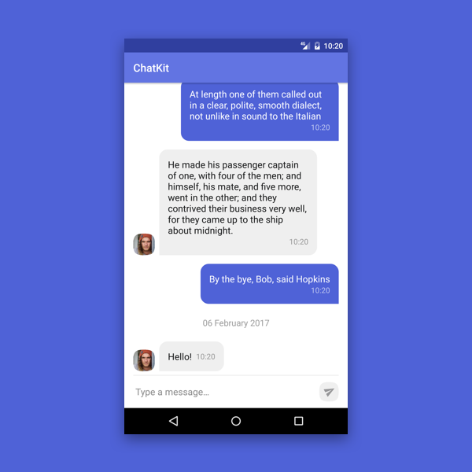
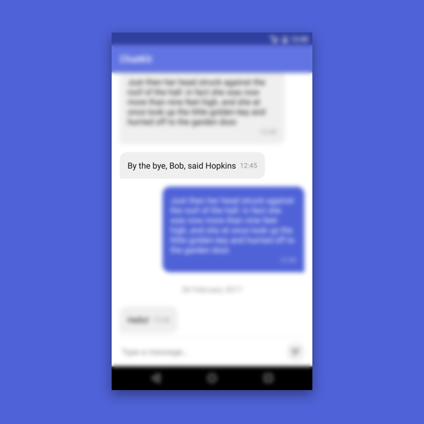
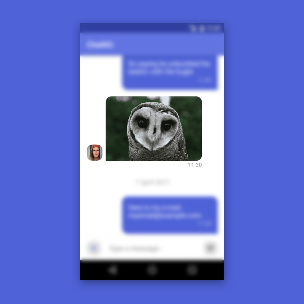
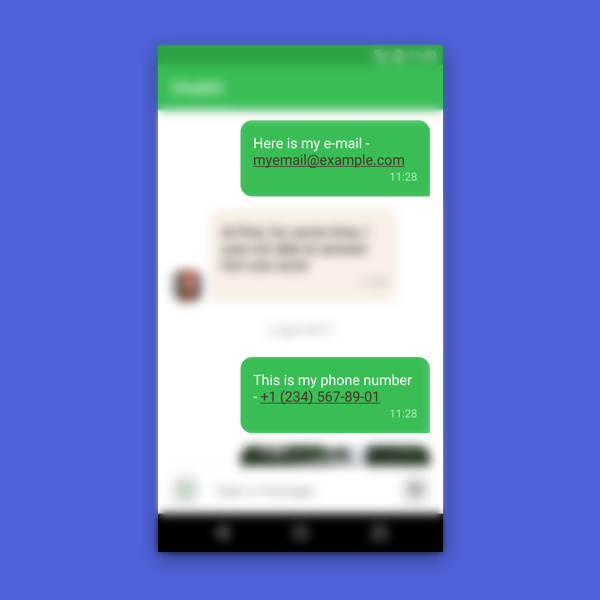
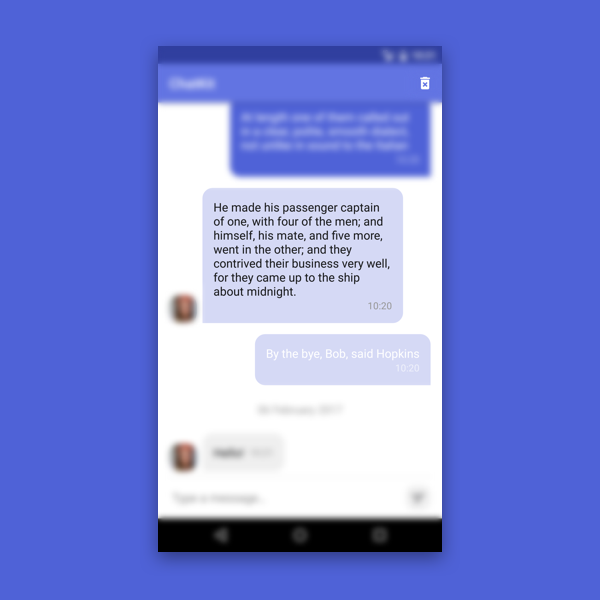
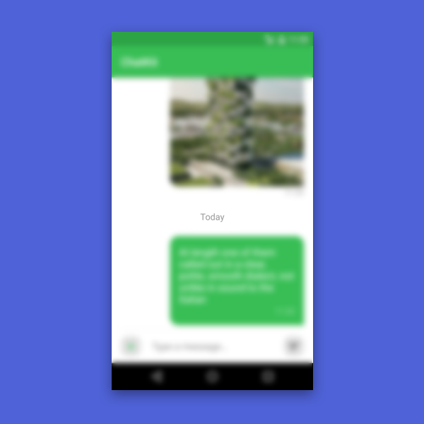
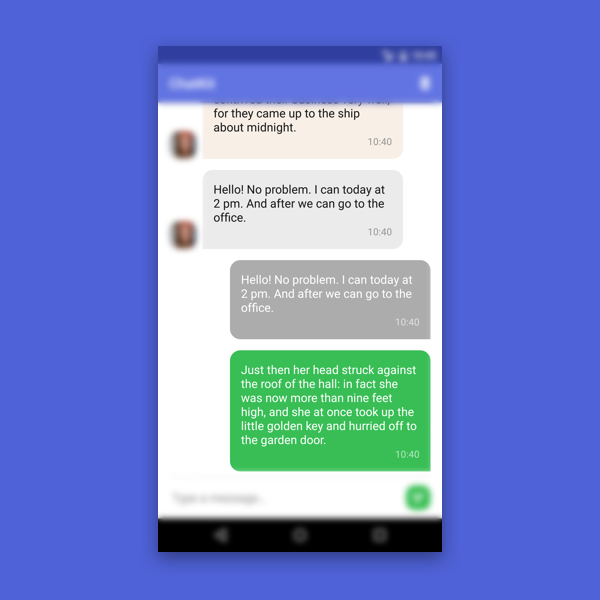
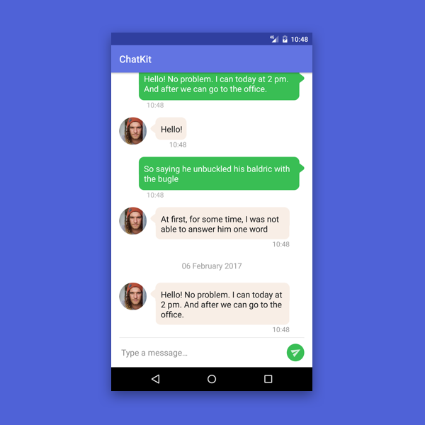
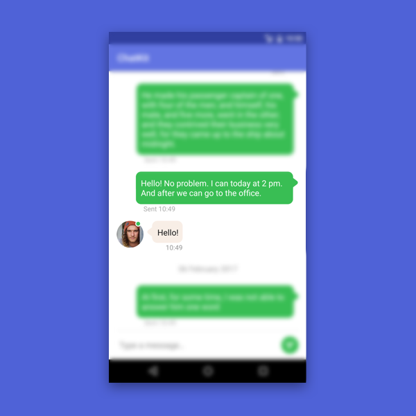

# MessagesList

MessagesList is a component for displaying and management of messages in conversation. Its main feature is a correct and simple interaction with a list of messages and date headers, which is implemented via adapter. Also, it supports several customization levels to let you add all of the features, that wasn’t included by default.
<p align="center">

</p>

## How to make it work

To start using the component you just need to follow several steps:

#### Add this widget into your xml layout:

```xml
<com.stfalcon.chatkit.messages.MessagesList
   android:id="@+id/messagesList"
   android:layout_width="match_parent"
   android:layout_height="match_parent"
   android:layout_above="@+id/input" />
```
#### Set an adapter

Adapter’s constructor takes a sender id (a user on whose behalf messages are sending) and implementation of ImageLoader to load avatars in messages ([Click here to learn more about image loading](IMAGE_LOADER.md)).


```java
MessagesListAdapter<Message> adapter = new MessagesListAdapter<>(senderId, imageLoader);
messagesList.setAdapter(adapter);
```
Anyway, you can pass second parameter as `null`, and avatars will be hidden.

#### Prepare your model

To be able to add messages, you must implement the `IMessage` interface into your existing model and override its methods:

```java
public class Message implements IMessage {

   /*...*/

   @Override
   public String getId() {
       return id;
   }

   @Override
   public String getText() {
       return text;
   }

   @Override
   public Author getUser() {
       return author;
   }

   @Override
   public Date getCreatedAt() {
       return createdAt;
   }
}
```
As you can see, you need also to add the Author object, which must to implement `IUser` interface:

```java
public class Author implements IUser {

   /*...*/

   @Override
   public String getId() {
       return id;
   }

   @Override
   public String getName() {
       return name;
   }

   @Override
   public String getAvatar() {
       return avatar;
   }
}
```
It describes info of message author, such as user id (to differ the incoming and outgoing messages), user name and his/her avatar. If user doesn't have avatar image, you can return `null`, and image will not be shown in incoming message item:
<p align="center">

</p>
That's all! This approach allows the adapter to work with your message model without type converting of any kind!

## Data management

#### Adding new messages

When your models are ready to be used by adapter, you can simply add them to the list. There are two ways to do it:
 * by adding one message to the start (bottom) of the list with scrolling (if needed). This method is best suitable for adding new messages by calling the `adapter.addToStart(IMessage message, boolean scroll)`;
 * by adding the previous messages of chatting history to the end (top) of the list with `adapter.addToEnd(List<IMessage> messages, boolean reverse)` method. Note that you can reverse the list before adding, if messages aren’t in the right order.

#### Adding messages from history

Ok, now we can add our messages. But how can we handle the history pagination? For this case, adapter has `OnLoadMoreListener` with `onLoadMore(int page, int totalItemsCount)` callback. It fires every time the user scrolls a list to the top. You can do your logic like this:

```java
@Override
public void onLoadMore(int page, int totalItemsCount) {
   if (totalItemsCount < this.total) {
       loadMessages(...);
   }
}
```
The `page` variable contains next page number to load (which is equals to the amount of executions) and `totalItemsCount`, that contains current messages counter in the list.

#### Adding image message

Can modern chat exist without media message exchange? The right answer is - no, it can't. Even in the simplest apps this feature is “must have”. With ChatKit, adding this feature is easier than ever!
At this moment "out of the box" library contains anly the most popular type of media messages - image messages. All you need to implement it is to mark your `Message` object with the `MessageContentType.Image` interface and override its `getImageUrl()` method:
```java
public class Message implements IMessage,
       MessageContentType.Image {
    ...
    @Override
    public String getImageUrl() {
       return image == null ? null : image.url;
    }
}
```
If the method returns `null`, the adapter recognizes the message as a text message and displays it in the appropriate form. If the url of the image is present, an image will be displayed using `ImageLoader`, which we passed to the adapter:
<p align="center">

</p>

#### Date headers

There’s no need to worry about date headers generation, it proceeds automatically while adding and deleting messages from the list considering all the possible cases. Also it’s fully localized, because it’s created with native java methods.

#### Deleting messages

To delete messages from the list, you need to call `adapter.deleteById(String id)` and `adapter.deleteByIds(String[] ids)`. Just for convenience, these methods also have overloadings for objects (delete(IMessage message), delete(List<IMessage> messages)), which work exactly the same.

To delete all messages, just call `adapter.clear()` method.

#### Updating messages

If message has changed, you can update it by calling `adapter.update(IMessage message)`. Or call `adapter.update(String oldId, IMessage message)`, when identifier has changed.

## Interact with user’s actions

#### Click listeners

Of course, the adapter has listeners for such important actions as short and long clicks. They just returns a message object that has been pressed, with a type that is specified as the generic type of adapter:

```java
public interface OnMessageClickListener<MESSAGE extends IMessage> {
   void onMessageClick(MESSAGE message);
}
public interface OnMessageLongClickListener<MESSAGE extends IMessage> {
   void onMessageLongClick(MESSAGE message);
}
```

Also here is an ability to set listeners on separate Views in message item:
```
public void registerViewClickListener(int viewId, OnMessageViewClickListener<MESSAGE> onMessageViewClickListener) 
```

#### Links highlighting
In 99% of cases the user is confused, when he can not follow the link or call the phone, indicated in the message. If you think the same way, just include `textAutoLink="all"`, like in the ordinary `TextView`. Similarly, you can specify highlighting for certain types, for example, `email|phone|web`:
<p align="center">

</p>

#### Selection mode

But these listeners are not enough, if you want to create really convenient UX. Just imagine, how long users will remove, copy or share messages by doing those actions one by one. What a waste of time!

For this case we have the selection mode, that turns on after user long press, and turns off, if amount of selected items is changed to zero. By default this behaviour is disabled, but you can enable it by calling `adapter.enableSelectionMode(SelectionListener selectionListener)`. The object in this parameter is the listener for selected messages count, that can be used as trigger for toolbar action mode (for example):
<p align="center">

</p>
...and the code looks like this:

```java
@Override
public void onSelectionChanged(int count) {
   menu.findItem(R.id.action_delete).setVisible(count > 0);
}
```
After messages are selected, you can get them with `adapter.getSelectedMessages()` as a list of objects. Then you can call `adapter.unselectAllItems()`, it will cancel messages’ selection, and call `SelectionListener.onSelectionChanged()` with zero as parameter to let you change the action mode.

Furthermore, if you want to delete selected messages, just call  `adapter.deleteSelectedMessages()` method, and it will do all the work for you. But you need to call `adapter.getSelectedMessages()` before deleting messages from the list to make delete request from your data source.

If you need to disable selection mode on-the-fly, use `adapter.disableSelectionMode()`. It will cancel items’ selection and remove the listener.

**N.B.! When selection mode is enabled, your custom `OnMessageLongClickListener` will be ignored due to the conflict of logic.**

#### Messages copying
Another convenient feature is the copying of the selected messages to the clipboard. If you enable `selection mode`, you can very easily copy the text by calling the `copySelectedMessagesText` method, which will also return this text after the call. If for some reason you needed to get the text without copying it, you can use the `getSelectedMessagesText` method. Both of these methods receive `MessagesAttribute.Formatter<Message>` as a parameter, which allows you to specify your own copying format:
```java
new MessagesListAdapter.Formatter<Message>() {
   @Override
   public String format(Message message) {
       String createdAt = new SimpleDateFormat("MMM d, EEE 'at' h:mm a", Locale.getDefault())
               .format(message.getCreatedAt());

       return String.format(Locale.getDefault(), "%s: %s (%s)",
               message.getUser().getName(), text, createdAt);
   }
};
```
If `Formatter` is null, the `toString()` method will be called for each message.

## Make it look the way you want

Certainly, initially defined appearance will not be suitable for everybody. And again, we have several options to solve this problem.

#### Dates format for headers
By default, the date in the date header is specified in the `d MMMM yyyy` format, but this does not satisfy all requirements. For example, you need to display such common options as "Today", "Yesterday" etc. To achieve this we have the `DateFormatter.Formatter` interface:
```java
@Override
public String format(Date date) {
   if (DateFormatter.isToday(date)) {
       return DateFormatter.format(date, DateFormatter.Template.TIME);
   } else if (DateFormatter.isYesterday(date)) {
       return getString(R.string.date_header_yesterday);
       …...
   } else {
       return DateFormatter.format(date, DateFormatter.Template.STRING_DAY_MONTH_YEAR);
   }
}
```
After creating it, you can pass it to adapter:
```java
messagesAdapter.setDateHeadersFormatter(formatter);
```
...and get this kind of result:
<p align="center">

</p>

#### Styling via attributes

The simplest way to customize appearance is to use `MessageList` widget attributes. With them we can set up a default background color for incoming and outcoming messages, and even the colors for their pushed conditions and single selection. You can also change color and size for message font, send time and data in the headers. Now, by defining attributes this way:

```xml
<com.stfalcon.chatkit.messages.MessagesList
   android:id="@+id/messagesList"
   android:layout_width="match_parent"
   android:layout_height="match_parent"
   app:incomingDefaultBubbleColor="@color/ivory"
   app:incomingDefaultBubblePressedColor="@color/ivory_dark"
   app:incomingDefaultBubbleSelectedColor="@color/gray"
   app:incomingDefaultImageOverlayPressedColor="@color/black_10"
   app:incomingDefaultImageOverlaySelectedColor="@color/gray_transparent"
   app:incomingTextColor="@color/black"
   app:incomingTextLinkColor="@color/green"
   app:incomingTextSize="18sp"
   app:outcomingDefaultBubbleColor="@color/green"
   app:outcomingDefaultBubblePressedColor="@color/green_dark"
   app:outcomingDefaultBubbleSelectedColor="@color/gray_dark_transparent"
   app:outcomingDefaultImageOverlayPressedColor="@color/black_10"
   app:outcomingDefaultImageOverlaySelectedColor="@color/gray_transparent"
   app:outcomingTextColor="@color/white"
   app:outcomingTextLinkColor="@color/brown"
   app:outcomingTextSize="18sp"/>
```
...we can get something like this:
<p align="center">

</p>
If the shape of bubble doesn't suits you, set your own drawable through the `incomingBubbleDrawable` / `outcomingBubbleDrawable` attribute. However, color customization attributes would not work for setting their state color, you should describe this behavior using selectors. Also you can set padding for each of them by using `incomingBubblePaddingXXX` and `outcomingBubblePaddingXXX` attributes. In the same way you can set custom overlay drawable for image messages (without padding, of course).

In case if you don’t like default data format, you can set it with only one line by using java date format — `dateHeaderFormat="dd.MM.yy"`

You can view [all available attributes here](STYLES_ATTR.md)

#### Create your own layout

But what if you need not only to change the appearance of the elements, but also to change their position? It does not matter, because you can create your own layout! The only condition — IDs must match with default IDs, and widget types should not cause a ClassCastException (ie, either be the same or the subclass type). Here are IDs with types, which were defined in MessageList:

* `@id/bubble` (ViewGroup)
* `@id/messageText` (TextView)
* `@id/messageTime`  (TextView)
* `@id/messageUserAvatar` (ImageView)

For better understanding see how [custom layout looks like](https://github.com/stfalcon-studio/ChatKit/blob/master/sample/src/main/res/layout/item_custom_incoming_text_message.xml)

After a layout was created, you need to put it into `HoldersConfig` object, which has appropriate methods for each layout files: `setIncomingLayout(int layoutRes)`, `setOutcomingLayout(int layoutRes)` `setDateHeaderLayout(int layoutRes)`. To hook up a config object, you need to transfer it to adapter through a constructor:

```java
MessagesListAdapter.HoldersConfig holdersConfig = new MessagesListAdapter.HoldersConfig();
holdersConfig.setIncomingLayout(R.layout.item_custom_incoming_message);
holdersConfig.setOutcomingLayout(R.layout.item_custom_outcoming_message);
adapter = new MessagesListAdapter<>(senderId, holdersConfig, imageLoader);
```
<p align="center">

<h6 align="center">Here we’ve changed a message time position, an avatar shape and a bubble shape.</h6>
</p>

#### Not enough features? Create your own holder!

Sometimes a message text displaying is not enough. For example, you need to add the message processing status and reactions to the message (as in Slack). Of course, for this purpose you have to create your own layout, but you can’t do it without changing the logic of ViewHolder. `HolderConfig` can do the trick. You can transfer your own holder class with `setIncomingHolder(Class holderClass)`, `setOutcomingHolder(Class holderClass)` and `setDateHeaderHolder(Class holderClass)` methods in it. For convenience' sake, it also contains methods for simultaneous adding of layout file and holder:

```java
holdersConfig.setIncoming(CustomIncomingMessageViewHolder.class,
        R.layout.item_custom_holder_incoming_message);
holdersConfig.setOutcoming(CustomOutcomingMessageViewHolder.class,
        R.layout.item_custom_holder_outcoming_message);
```
To create your own holder, you need to inherit your class from `MessagesListAdapter.BaseMessageViewHolder<>`, and transfer your message class to generic type, because on the assumption of it the `onBind(IMessage message)` method will be typified. This method is similar to `onBindViewHolder()` method from `RecyclerView.Adapter` class: you can manipulate your data from it and upload images through `protected` of the `ImageLoader` field, and get `isSelected` state.

However, if you’re going to add new features without rewriting behavior from a scratch, you can inherit standard realization class from a holder you need:

* `IncomingMessageViewHolder` - incoming message holder;
* `OutcomingMessageViewHolder` - outgoing message holder;
* `DefaultDateHeaderViewHolder` - date separator holder.

For example, you can add status for outgoing messages with only few lines:

```java
public class CustomOutcomingMessageViewHolder
       extends MessagesListAdapter.OutcomingMessageViewHolder<Message> {

   public CustomOutcomingMessageViewHolder(View itemView, Object payload) {
       super(itemView, payload);
   }

   @Override
   public void onBind(Message message) {
       super.onBind(message);

       time.setText(message.getStatus() + " " + time.getText());
   }
}
```
<p align="center">

<h6 align="center">Pay attention to outgoing message’ status and online indicator.</h6>
</p>

#### Passing custom data to your ViewHolder
You can pass any data to your custom ViewHolder. To do this, firstly you need override the constructor `super(View itemView, Object payload)` (the constructor `super(View itemView)` is deprecated and will be deleted in one of the new version of library). After that you can pass data as third parameter in method `MessageHolders().setXXXConfig`.
For example, let's add click listener in incoming text message on avatar click.
Create interface for click callback and payload class to store it:
```java
public interface OnAvatarClickListener {
        void onAvatarClick();
}

public class Payload {
        public OnAvatarClickListener avatarClickListener;
} 
```
Then in our custom ViewHolder in method `onBind`:
```java
@Override
    public void onBind(Message message) {
        super.onBind(message);
        ...
        //We can set click listener on view from payload
        final Payload payload = (Payload) this.payload;
        userAvatar.setOnClickListener(new View.OnClickListener() {
            @Override
            public void onClick(View view) {
                if (payload != null && payload.avatarClickListener != null) {
                    payload.avatarClickListener.onAvatarClick();
                }
            }
        });
    }
```
Then create Payload and set it and our ViewHolder class to MessageHolders config.
```java
//We can pass any data to ViewHolder with payload
CustomIncomingTextMessageViewHolder.Payload payload = new CustomIncomingTextMessageViewHolder.Payload();
//For example click listener
payload.avatarClickListener = new CustomIncomingTextMessageViewHolder.OnAvatarClickListener() {
    @Override
    public void onAvatarClick() {
        Toast.makeText(CustomHolderMessagesActivity.this,
                "Text message avatar clicked", Toast.LENGTH_SHORT).show();
    }
};

MessageHolders holdersConfig = new MessageHolders()
        .setIncomingTextConfig(
                CustomIncomingTextMessageViewHolder.class,
                R.layout.item_custom_incoming_text_message,
                payload)
                ...
```

#### Custom content types
We understand that ony images as media messages are often not enough. Therefore, we implemented the ability to add custom content types for displaying different types of content (geopoints, video, voice messages etc.).

To do this, you just need to implement the `MessageContentType` interface. However, you do not need to override any methods at his time. After that, you need to prepare your own layout files for displaying incoming and outcoming messages of this type, as well as ViewHolders (for binding data to view). And after that you can register them in the adapter via the `MessageHolders` object.

For example, let's add support of voice messages:
```java
MessageHolders holders = new MessageHolders()
       .registerContentType(
               CONTENT_TYPE_VOICE,
               IncomingVoiceMessageViewHolder.class,
               R.layout.item_custom_incoming_voice_message,
               OutcomingVoiceMessageViewHolder.class,
               R.layout.item_custom_outcoming_voice_message,
               contentChecker);


super.messagesAdapter = new MessagesListAdapter<>(super.senderId, holders, super.imageLoader);
```
We passed an identifier (which will come in handy to us a little later), markup files and ViewHolder classes for incoming and outcoming states, and `contentChecker` to the method. `ContentChecker` is an instance of the `MessageHolders.ContentChecker<Message>` class, where the content is checked for the registered type by its id:
```java
@Override
public boolean hasContentFor(Message message, byte type) {
   switch (type) {
       case CONTENT_TYPE_VOICE:
           return message.getVoice() != null
                   && message.getVoice().getUrl() != null
                   && !message.getVoice().getUrl().isEmpty();
   }
   return false;
}
```
If the `hasContentFor` method returns `true` for the selected type, the corresponding item for that type will be created and the `onBind(Message message)` method of the registered ViewHolder will be called (the adapter itself recognizes and processes incoming and outcoming message types). In case the method returns `false`, the adapter will poll all other registered types. If there's no content for all known types, the message will be recognized as text.

As the result, well get the following:
<p align="center">

</p>
